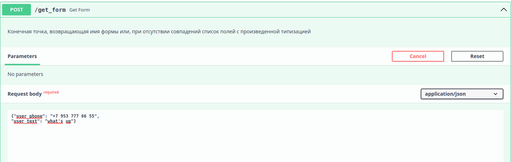
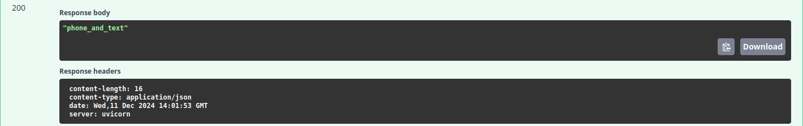

# Find form project
Web-приложение для определения заполненных форм.
По url /get_form получает POST-запрос со списком полей в теле запроса.  
Возвращает имя наиболее подходящей формы, либо производит типизацию полей и возвращает список полей с их типами.

### Содержание:
* [Используемые технологии](#используемые-технологии-)
* [Запуск проекта локально](#запуск-проекта-локально)
* [Тестирование проекта с помощью Swagger UI](#тестирование-проекта-с-помощью-swagger-ui)

### Используемые технологии: 
* Python 3.11
* FastAPI
* tinydb
* pytest

### Запуск проекта локально
1. Клонируйте проект с помощью команды:  
git clone https://github.com/mike-sazonov/task_manager.git
2. Настройте виртуальную среду
3. В папку app проекта добавьте файл базы данных db.json 
4. Командой **python -m pytest tests/** запускаем тесты.

### Тестирование проекта с помощью Swagger UI

* **Запустите проект из файла main.py, после чего перейдите по ссылке** http://127.0.0.1:8000/docs.  
* **В открывшемся интерфейсе можно взаимодействовать с приложением:**

